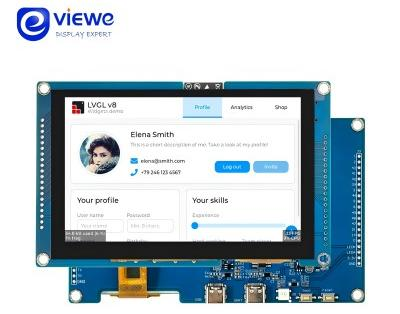

<h1 align = "center">VIEWE ESP32-S3 Smart Display Quick Guide </h1>
<p align="center">
    
    <h1 align = "center" style="font-size: 18px;">Model: UEDX80480050E-WB-A</h1>
</p>

* **[中文版](./README_CN.md)**

## Directory
- [Repository Directory Overview](#repository-directory-overview)
- [PurchaseLink](#purchaseLink)
- [Hardware Overview](#hardware-overview)
- [QuickStart](#quickstart)
- [PinOverview](#pinoverview)
- [Schematic](#schematic)
- [Information](#information)
- [firmware download](#firmware-download)
- [FAQ](#faq)

## Repository Directory Overview

```
├── Libraries         Library files required for the Arduino example  
├── Schematic         The circuit schematic of the product   
├── examples          Sample files, including the IDF framework and the Arduino framework
├── firmware          firmware
├── image             Product or sample project related images
├── information       Product specifications, including the IC or peripherals involved
├── tools             Burn tool and image conversion tool
├── README_CN.md      Chinese version Quick Guide and Product Brief
└── README.md         English version of the quick guide and product introduction
```

## PurchaseLink

| Product                     | SOC           |  FLASH  |  PSRAM   | Link                   |
| :------------------------: | :-----------: |:-------: | :---------: | :------------------: |
| UEDX80480050E-WB-A V1.1   | ESP32S3R8 |   16M   | 8M (Octal SPI) | [VIEWE Mall](https://viewedisplay.com/product/esp32-7-inch-800x480-rgb-ips-tft-display-touch-screen-arduino-lvgl-uart/)  |

## Hardware Overview

### 1.MCU
* Chip: ESP32-S3-N16R8
* PSRAM: 8M (Octal SPI) 
* FLASH: 16M
* For more details, please visit[Espressif ESP32-S3 Datashee](https://www.espressif.com.cn/sites/default/files/documentation/esp32-s3_datasheet_en.pdf)

### 2. Screen
* Size: 5-inch IPS screen
* Resolution: 800x480px
* Screen type: IPS
* Driver chip: ST7262E43-G4
* Compatibility library:  ESP32_Display_Panel
* Bus communication protocol: RGB
* For more details：[Display Datasheet](information/UE050WV-RB40-L070A.pdf)
  
Note: The model name is determined by the screen resolution and size

### 3. Touch
* Chip: GT911
* Bus communication protocol: IIC
* For more details：[Touch IC Datasheet_EN](information/GT911_EN_Datasheet.pdf)

## Hardware Connections
- Connect the screen ribbon cable and touch ribbon cable (gold contacts 
 facing up).
- USB-C power supply (5V/1A adapter).
- UART for programming, debugging, or power supply (5V/1A adapter).
- For the first programming, press and hold the `BOOT` button to enter 
 download mode.
<p align="center" width="100%">
    
</p>


## QuickStart

### Software Framework Configuration

| Support IDE | Version |
| ------  | ------  |
| `[ESP-IDF]` | `[V5.1/5.2/5.3]` |
| `[Arduino IDE]` | `[esp32 >=v3.0.7]` | 
| `[Platformio IDE]` |  |
### ESP-IDF Framework ([Novice tutorial]())
- Supported Versions: v5.1/5.2/5.3
- Download the example code from the repository and compile/run it directly.
- Repository Address: [examples](examples/esp_idf)

### Arduino Framework ([Novice tutorial]())
1. Install[Arduino](https://www.arduino.cc/en/software),Choose installation based on your system type.
2. Install the ESP32 core: Search for and download `esp32`(by Espressif >= v3.0.7) in the `Board Manager`.
3. Install the required libraries:
    * Search and install `ESP32_Display_Panel` (v1.0.0). Select `Yes` for automatic dependency installation.
    * Install the `LVGL` (v8.4.0) library. 
4. Open the example: `ESP32_Display_Panel`-> `examples` -> `arduino` -> `gui` -> `lvgl_v8`.
5. Configure the development board:
    * Edit the `esp_panel_board_supported_conf.h` file.
    * Enable the macro: `#define ESP_PANEL_BOARD_DEFAULT_USE_SUPPORTED  (1)`
    * Uncomment the corresponding screen model definition: `#define BOARD_VIEWE_UEDX80480070E_WB_A`
6. Configure tool options (S3):
   
    | Setting                               | Value                         |
    | :-------------------------------: | :-------------------------------: |
    | Board                                 | ESP32S3 Dev Module            |
    | Core Debug Level                | None                                |
    | USB CDC On Boot                | Disabled                             |
    | USB DFU On Boot                | Disabled                             |
    | Flash Size                           | 16MB (128Mb)                   |
    | Partition Scheme                | 16M Flash (3MB APP/9.9MB FATFS)     |
    | PSRAM                                | OPI PSRAM                      |
   
7. Select the correct port.
8. Click "<kbd>[√](image/8.png)</kbd>" in the upper right corner to compile,If the compilation is correct, connect the microcontroller to the computer,Click "<kbd>[→](image/9.png)</kbd>" in the upper right corner to download.

### PlatformIO ([Novice tutorial]())
1. Install[VisualStudioCode](https://code.visualstudio.com/Download),Choose installation based on your system type.

2. Open the "Extension" section of the Visual Studio Code software sidebar(Alternatively, use "<kbd>Ctrl</kbd>+<kbd>Shift</kbd>+<kbd>X</kbd>" to open the extension),Search for the "PlatformIO IDE" extension and download it.

3. During the installation of the extension, you can go to GitHub to download the program. You can download the main branch by clicking on the "<> Code" with green text.

4. After the installation of the extension is completed, open the Explorer in the sidebar(Alternatively, use "<kbd>Ctrl</kbd>+<kbd>Shift</kbd>+<kbd>E</kbd>" go open it),Click "Open Folder", find the project code you just downloaded (the entire folder), then find the PlatformIO folder and click "Add". At this point, the project file will be added to your workspace.

5. Open the "platformio.ini" file in the project folder (PlatformIO will automatically open the "platformio.ini" file corresponding to the added folder). Under the "[platformio]" section, uncomment and select the example program you want to burn (it should start with "default_envs = xxx") Then click "<kbd>[√](image/4.png)</kbd>" in the bottom left corner to compile,If the compilation is correct, connect the microcontroller to the computer and click "<kbd>[→](image/5.png)</kbd>" in the bottom left corner to download the program.

## PinOverview

| IPS Screen Pin  | ESP32S3 Pin|
| :------------------: | :------------------:|
| DE         | IO40       |
| VS         | IO41       |
| HS         | IO439       |
| PCLK       | IO42       |
|   R0       |  IO45   |
|   R1       |  IO48   |
|   R2       |  IO47   |
|   R3       |  IO21   |
|   R4       |  IO14   |
|   G0       |  IO5   |
|   G1       |  IO6   |
|   G2       |  IO7   |
|   G3       |  IO15   |
|   G4       |  IO16   |
|   G5       |  IO4   |
|   B0       |  IO8   |
|   B1       |  IO3   |
|   B2       |  IO46   |
|   B3       |  IO9   |
|   B4       |  IO1   |
| RST        | IO39       |
| BACKLIGHT  | IO2       |

| Touch Chip Pin  | ESP32S3 Pin|
| :------------------: | :------------------:|
| RST         | IO38 |
| INT         | IO18 |
| SDA         | IO19 |
| SCL         | IO20 |

| USB (CH340C) Pin  | ESP32S3 Pin|
| :------------------: | :------------------:|
| D+(USB-DP)    | IO20       |
| D-(USB-DN)    | IO19       |

| button Pin  | ESP32S3 Pin|
| :------------------: | :------------------:|
|   boot    | IO0       |
|   reset   | chip-en   |

| SD Card Pin  | ESP32S3 Pin|
| :------------------: | :------------------:|
| D1         | IO18       |
| D2         | IO15       |
| MOSI        | IO17       |
| MISO         | IO16       |

| UART/RS485 Pin  | ESP32S3 Pin|
| :------------------: | :------------------:|
| UARTTX         | IO43(RXD0)      |
| UARTRX         | IO44(TXD0)      |

| RGB LED Pin  | ESP32S3 Pin|
| :------------------: | :------------------:|
| RGB LED         | IO0 |

## Schematic
<p align="center" width="100%">
    
</p>

## Information
[products specification](information/UEDX80480050E-WB-A%20V3.3%20SPEC.pdf)

[Display Datasheet](information/UE050WV-RB40-L070A.pdf)

[Touch IC Datasheet_EN](information/GT911_EN_Datasheet.pdf)

[Touch IC Datasheet_CN](information/GT911_CN_Datasheet.pdf)

[5050RGB-LED](information/C2843785_RGB%2BLED(Built-in%20IC)_XL-5050RGBC-WS2812B_specification_WJ1123912.PDF)

[CH340C](information/C84681_USB%20Conversion%20chip_CH340C_specification_WJ1187874.PDF)

## firmware download
1. Open the project file "tools" and locate the ESP32 burning tool. Open it.

2. Select the correct burning chip and burning method, then click "OK." As shown in the picture, follow steps 1->2->3->4->5 to burn the program. If the burning is not successful, press and hold the "BOOT-0" button and then download and burn again.

3. Burn the file in the root directory of the project file "[firmware](./firmware/)" file,There is a description of the firmware file version inside, just choose the appropriate version to download.

<p align="center" width="100%">
    
    
</p>

## FAQ

* Q. After reading the above tutorials, I still don't know how to build a programming environment. What should I do?
* A. If you still don't understand how to build an environment after reading the above tutorials, you can refer to the [VIEWE-FAQ]() document instructions to build it.

<br />

* Q. Why does Arduino IDE prompt me to update library files when I open it? Should I update them or not?
* A. Choose not to update library files. Different versions of library files may not be mutually compatible, so it is not recommended to update library files.

<br />

* Q. Why is there no serial data output on the "Uart" interface on my board? Is it defective and unusable?
* A. The default project configuration uses the USB interface as Uart0 serial output for debugging purposes. The "Uart" interface is connected to Uart0, so it won't output any data without configuration.<br />For PlatformIO users, please open the project file "platformio.ini" and modify the option under "build_flags = xxx" from "-D ARDUINO_USB_CDC_ON_BOOT=true" to "-D ARDUINO_USB_CDC_ON_BOOT=false" to enable external "Uart" interface.<br />For Arduino users, open the "Tools" menu and select "USB CDC On Boot: Disabled" to enable the external "Uart" interface.

<br />

* Q. Why is my board continuously failing to download the program?
* A. Please hold down the "BOOT" button and try downloading the program again.


