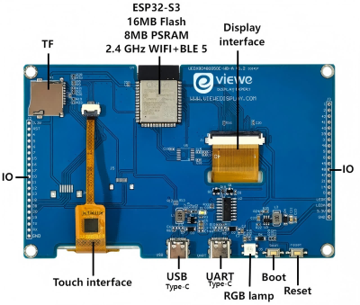

<h1 align = "center">VIEWE ESP32-S3智能显示屏快速指南</h1>

<div align="center">
    
    <h1 style="font-size: 18px;">型号: UEDX80480070E-WB-A</h1>
</div>

* **[English Version](./README.md)**

## 目录
- [仓库目录说明](#仓库目录说明)
- [购买链接](#购买链接)
- [硬件概述](#硬件概述)
- [快速上手](#快速上手)
- [引脚定义](#引脚定义)
- [电路图](#电路图)
- [技术资料](#技术资料)
- [固件下载](#固件下载)
- [常见问题](#常见问题)

## 仓库目录说明

```
├── Libraries     Arduino 示例所需库文件
├── Schematic     产品电路图
├── examples      示例文件（包含 IDF 和 Arduino 框架）
├── firmware      固件文件
├── image         产品及示例相关图片
├── information   产品规格书（含芯片及外设资料）
├── tools         烧录工具及镜像转换工具
├── README_CN.md  中文版快速指南和产品简介
└── README.md     英文版快速指南和产品简介
```

## 购买链接

| 产品                     | 主控芯片     | 闪存   | PSRAM   | 购买链接                   |
| :------------------------: | :-----------: |:-------: | :---------: | :------------------: |
| UEDX80480070E-WB-A V1.1   | ESP32S3R8 | 16MB   | 8M（八线SPI） | [VIEWE商城](https://viewedisplay.com/product/esp32-7-inch-800x480-rgb-ips-tft-display-touch-screen-arduino-lvgl-uart/)  |

## 硬件概述

### 1.主控单元
- 芯片: ESP32-S3-N16R8
- PSRAM: 8M（八线SPI）
- 闪存: 16M
- 详细资料: [Espressif ESP32-S3数据手册](https://www.espressif.com.cn/sites/default/files/documentation/esp32-s3_datasheet_en.pdf)

### 2.显示屏
- 尺寸: 7英寸IPS屏
- 分辨率: 800x480px
- 屏幕类型: IPS
- 驱动芯片: EK9716BD3+EK73002AB2
- 兼容库: ESP32_Display_Panel
- 总线协议: RGB
- 详细资料：[屏幕数据手册](information/ALL-UE070WV-RB40-A092A.pdf)

注：型号由屏幕尺寸和分辨率决定

### 3.触摸模块
- 芯片: GT911
- 总线协议: IIC
- 详细资料：[触摸IC数据手册](information/GT911_CN_Datasheet.pdf)

## 硬件连接
- 连接屏幕排线和触摸排线（金色触点朝上）
- USB-C供电（5V/1A适配器）
- UART用于编程/调试/供电（5V/1A适配器）
- 首次烧录需按住`BOOT`键上电进入下载模式，后续若出现无法下载也可尝试如此
<div align="center" width="100%">
    
</div>

## 快速上手

### 软件框架支持

| 支持IDE       | 版本要求       |
|--------------|--------------|
| `[ESP-IDF]`  | `[V5.1/5.2/5.3]` |
| `[Arduino IDE]` | `[esp32 >=v3.0.7]` |
| `[Platformio IDE]` |  |

### ESP-IDF框架 ([新手教程]())
- 支持版本: v5.1/5.2/5.3
- 直接从仓库下载示例代码编译运行
- 代码路径: [examples](examples/esp_idf)

### Arduino框架 ([新手教程]())
1. 安装[Arduino](https://www.arduino.cc/en/software)
2. 安装ESP32核心：在Board Manager中搜索下载`esp32`（版本>=v3.0.7）
3. 安装依赖库：
    * 搜索安装`ESP32_Display_Panel`（v1.0.0），自动安装依赖
    * 安装`LVGL`（v8.4.0）库
4. 打开示例：`ESP32_Display_Panel`-> `examples` -> `arduino` -> `gui` -> `lvgl_v8`
5. 开发板配置：
    * 编辑`esp_panel_board_supported_conf.h`
    * 启用宏定义: `#define ESP_PANEL_BOARD_DEFAULT_USE_SUPPORTED  (1)`
    * 取消注释屏幕型号定义: `#define BOARD_VIEWE_UEDX80480070E_WB_A`
6. 工具配置（S3）：

    | 配置项                            | 值                                   |
    | :-------------------------------: | :-------------------------------:    |
    | 开发板                             | ESP32S3 Dev Module                   |
    | Core Debug Level                  | None                                 |
    | USB CDC On Boot                   | Disabled                             |
    | USB DFU On Boot                   | Disabled                             |
    | Flash Size                        | 16MB (128Mb)                         |
    | Partition Scheme                  | 16M Flash (3MB APP/9.9MB FATFS)      |
    | PSRAM                             | OPI PSRAM                            |

7. 选择正确端口
8. 点击右上角"<kbd>[√](image/8.png)</kbd>"编译，成功后连接设备，点击"<kbd>[→](image/9.png)</kbd>"下载

### PlatformIO ([新手教程]())
1. 安装[VisualStudioCode](https://code.visualstudio.com/Download)
2. 安装"PlatformIO IDE"扩展
3. 从GitHub下载代码（点击绿色"<>"按钮）
4. 打开项目文件夹，添加到PlatformIO工作区
5. 编辑`platformio.ini`，取消注释所需示例环境，点击左下角"<kbd>[√](image/4.png)</kbd>"编译，成功后连接设备点击"<kbd>[→](image/5.png)</kbd>"下载

## 引脚定义

| IPS屏幕引脚 | ESP32S3引脚 |
|------------|------------|
| DE         | IO40       |
| VS         | IO41       |
| HS         | IO439      |
| PCLK       | IO42       |
| R0         | IO45       |
| R1         | IO48       |
| R2         | IO47       |
| R3         | IO21       |
| R4         | IO14       |
| G0         | IO5        |
| G1         | IO6        |
| G2         | IO7        |
| G3         | IO15       |
| G4         | IO16       |
| G5         | IO4        |
| B0         | IO8        |
| B1         | IO3        |
| B2         | IO46       |
| B3         | IO9        |
| B4         | IO1        |
| RST        | IO39       |
| BACKLIGHT  | IO2        |

| 触摸芯片引脚 | ESP32S3引脚 |
|------------|------------|
| RST        | IO38       |
| INT        | IO18       |
| SDA        | IO19       |
| SCL        | IO20       |

| USB(CH340C)引脚 | ESP32S3引脚 |
|----------------|------------|
| D+(USB-DP)     | IO20       |
| D-(USB-DN)     | IO19       |

| 按键引脚 | ESP32S3引脚 |
|--------|------------|
| BOOT   | IO0        |
| RESET  | CHIP-EN    |

| SD卡引脚 | ESP32S3引脚 |
|--------|------------|
| D1     | IO18       |
| D2     | IO15       |
| MOSI   | IO17       |
| MISO   | IO16       |

| UART/RS485引脚 | ESP32S3引脚 |
|---------------|------------|
| UARTTX        | IO43(RXD0) |
| UARTRX        | IO44(TXD0) |

| RGB LED引脚 | ESP32S3引脚 |
|------------|------------|
| RGB LED    | IO0        |

## 电路图
<div align="center" width="100%">
    
</div>

## 技术资料
[产品规格书](information/UEDX80480070E-WB-A%20V2.0%20SPEC.pdf)

[显示屏数据手册](information/ALL-UE070WV-RB40-A092A.pdf)

[触摸IC英文手册](information/GT911_EN_Datasheet.pdf)

[触摸IC中文手册](information/GT911_CN_Datasheet.pdf)

[5050RGB-LED规格书](information/C2843785_RGB%2BLED(Built-in%20IC)_XL-5050RGBC-WS2812B_specification_WJ1123912.PDF)

[CH340C芯片手册](information/C84681_USB%20Conversion%20chip_CH340C_specification_WJ1187874.PDF)

## 固件下载
1. 打开tools目录下的ESP32烧录工具
2. 选择正确芯片和烧录方式，按步骤1->2->3->4->5操作，失败时按住"BOOT-0"重试
3. 烧录根目录firmware文件夹中的固件文件（注意版本说明）
<div align="center" width="100%">
    
    
</div>

## 常见问题

* Q. 按照教程仍无法搭建开发环境怎么办？
* A. 可参考[VIEWE-FAQ]()文档进行环境搭建
  
<br />

* Q. Arduino提示更新库文件是否要更新？
* A. 建议选择不更新，不同版本可能存在兼容性问题

<br />

* Q. 开发板Uart接口无数据输出是否损坏？
* A. 默认使用USB作为Uart0输出，需配置后启用外部接口：
  - PlatformIO用户修改platformio.ini中的build_flags
  - Arduino用户在Tools菜单中设置"USB CDC On Boot: Disabled"

<br />

* Q. 开发板持续下载失败怎么办？
* A. 请按住"BOOT"键后重新尝试下载
